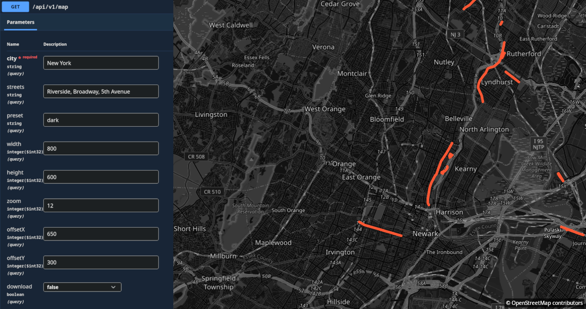

# StreetHighlighter

[](LICENSE)
[](https://github.com/serega404/streethighlighter/releases/latest)
[](https://dotnet.microsoft.com/download/dotnet/10.0)


[English version](README.en.md)

HTTP API на ASP.NET Core для генерации PNG-карт города с выделенными улицами поверх растровой подложки OpenStreetMap.

> **Дисклеймер:** первоначальная версия проекта была написана вручную, после чего разработка на некоторое время остановилась. Позднее проект был завершён преимущественно с помощью вайбкодинга. Значительная часть полученного кода не проходила подробное ревью человеком. Вместе с тем проект прошёл множество итераций анализа с использованием различных нейросетей, которым неоднократно предлагалось найти проблемы, предложить улучшения и оценить качество принятых решений.

StreetHighlighter принимает название города, список улиц и параметры оформления, получает границы города и геометрию дорог из сервисов OpenStreetMap, загружает необходимые тайлы и собирает итоговое изображение с помощью SkiaSharp. Проект подходит как основа для генератора маршрутных постеров, карт посещённых улиц и других серверных картографических изображений.
Пример результата:



## Возможности

- генерация PNG через `GET` или `POST`;
- автоматический подбор масштаба по границам города;
- принудительный уровень масштаба (`zoom`), если нужен предсказуемый охват;
- выделение нескольких улиц одним цветом;
- настройка цвета, прозрачности и толщины линий;
- пресеты `default`, `light` и `dark`;
- дисковый кэш границ города, геометрии улиц и тайлов;
- Swagger UI и OpenAPI-описание;
- логирование времени получения геоданных и отрисовки.

## Требования

- [.NET SDK 10.0](https://dotnet.microsoft.com/download/dotnet/10.0);
- доступ в интернет к Nominatim, Overpass API и серверу тайлов OpenStreetMap;
- права на запись в каталог `src/Cache`;
- операционная система, поддерживаемая SkiaSharp.

## Быстрый старт

Из корня репозитория восстановите зависимости и запустите HTTP-профиль:

```bash
dotnet restore streethighlighter.sln
dotnet run --project src/StreetHighlighter.csproj --launch-profile http
```

Откройте Swagger UI:

```text
http://localhost:5171/api/docs
```

## Использование API

Оба способа генерации используют endpoint `/api/v1/map`. Упрощённый `GET` удобен для ручной проверки, а `POST` предоставляет все параметры оформления. Отдельный `GET /api/v1/streets` возвращает названия улиц из OSM.

### API key

По умолчанию API открыто. Чтобы защитить API, задайте на сервере непустую переменную окружения `API_KEY`:

```bash
API_KEY='replace-with-a-long-random-secret' dotnet run --project src/StreetHighlighter.csproj --launch-profile http
```

При заданном `API_KEY` оба метода `/api/v1/map` и `GET /api/v1/streets` требуют тот же ключ в заголовке `X-API-Key`; при неверном или отсутствующем ключе возвращается `401 Unauthorized`. `/health` и Swagger UI остаются доступными без ключа. В Swagger нажмите **Authorize** и укажите ключ, чтобы выполнять запросы через интерфейс.

### GET `/api/v1/map`

Параметры query string:

| Параметр           | Тип      | По умолчанию | Описание                                                                                                                                     |
| ------------------ | -------- | ------------ | -------------------------------------------------------------------------------------------------------------------------------------------- |
| `city`             | `string` | —            | Название города. Обязательный параметр.                                                                                                      |
| `streets`          | `string` | пусто        | Имена улиц через запятую. Пробелы вокруг значений удаляются.                                                                                 |
| `preset`           | `string` | `default`    | Визуальный пресет: `default`, `light` или `dark`.                                                                                            |
| `width`            | `int`    | `800`        | Ширина PNG в пикселях.                                                                                                                       |
| `height`           | `int`    | `600`        | Высота PNG в пикселях.                                                                                                                       |
| `zoom`             | `int?`   | авто         | Принудительный уровень Web Mercator. Без него карта вписывает границы города.                                                                |
| `offsetX`          | `int`    | `0`          | Горизонтальный сдвиг содержимого карты в пикселях. Положительное значение сдвигает карту вправо.                                             |
| `offsetY`          | `int`    | `0`          | Вертикальный сдвиг содержимого карты в пикселях. Положительное значение сдвигает карту вниз.                                                 |
| `exactStreetNames` | `bool`   | `false`      | При `true` имя улицы должно целиком совпадать со значением тега OSM `name`; регистр не учитывается.                                          |
| `download`         | `bool`   | `false`      | Если `true`, отдаёт `Content-Disposition: attachment` для скачивания файла. По умолчанию `false` (inline для тегов `` и предпросмотра). |

Пример:

```bash
curl --get 'http://localhost:5171/api/v1/map' \
  --header 'X-API-Key: replace-with-your-key' \
  --data-urlencode 'city=Таганрог' \
  --data-urlencode 'streets=Петровская улица,улица Чехова' \
  --data-urlencode 'preset=dark' \
  --data-urlencode 'width=1200' \
  --data-urlencode 'height=800' \
  --data-urlencode 'offsetX=100' \
  --data-urlencode 'offsetY=-50' \
  --data-urlencode 'exactStreetNames=true' \
  --output map.png
```

В `GET` нельзя отдельно задать цвет, прозрачность и толщину выделения. Для этого используйте `POST`.

### GET `/api/v1/streets`

Возвращает уникальные значения тега OSM `name` для именованных дорог в прямоугольных границах найденного города. Названия сортируются без учёта регистра. Объекты без тегов `highway` или `name` в ответ не попадают.

```bash
curl --get 'http://localhost:5171/api/v1/streets' \
  --header 'X-API-Key: replace-with-your-key' \
  --data-urlencode 'city=Taganrog'
```

Пример ответа:

```json
{
  "cityName": "Таганрог",
  "cityNames": [
    "Taganrog",
    "Таганрог",
    "Таганрог, Ростовская область, Южный федеральный округ, Россия"
  ],
  "streets": [
    "0-я Аллея",
    "1 Аллея",
    "1-й Артиллерийский переулок",
    "1-й Бульварный переулок",
    "1-й Квартальный проезд",
    ...
  ]
}
```

`cityName` содержит короткое найденное название или исходный запрос, если Nominatim не предоставил его. `cityNames` содержит доступные уникальные варианты в порядке: запрос клиента, короткое имя и полное отображаемое имя Nominatim. Список основан на текущих данных OSM: улицы без собственного тега `name`, в том числе встречающиеся только в `addr:street`, не включаются.

Endpoint возвращает `400` для некорректного параметра `city`, `404` если город не найден, `502`/`504` при сбое внешнего сервиса и `500` при непредвиденной внутренней ошибке.

### POST `/api/v1/map`

Пример полного запроса:

```bash
curl --request POST 'http://localhost:5171/api/v1/map' \
  --header 'Content-Type: application/json' \
  --header 'X-API-Key: replace-with-your-key' \
  --data '{
    "cityName": "Таганрог",
    "highlightStreets": [
      "Петровская улица",
      "улица Чехова"
    ],
    "style": {
      "preset": "dark",
      "highlightColor": "#00E5FF",
      "opacity": 0.9,
      "strokeWidth": 6
    },
    "width": 1200,
    "height": 800,
    "zoom": null,
    "offsetX": 100,
    "offsetY": -50,
    "exactStreetNames": true
  }' \
  --output map.png
```

Поля тела запроса:

| Поле               | Тип        | По умолчанию      | Описание                                                                              |
| ------------------ | ---------- | ----------------- | ------------------------------------------------------------------------------------- |
| `cityName`         | `string`   | —                 | Обязательное название города.                                                         |
| `highlightStreets` | `string[]` | `[]`              | Улицы, которые нужно выделить.                                                        |
| `style`            | `object`   | стандартный стиль | Параметры подложки и линий. Не передавайте `null`.                                    |
| `width`            | `int`      | `800`             | Ширина результата в пикселях.                                                         |
| `height`           | `int`      | `600`             | Высота результата в пикселях.                                                         |
| `zoom`             | `int?`     | `null`            | Уровень масштаба или автоматическое вписывание города.                                |
| `offsetX`          | `int`      | `0`               | Горизонтальный сдвиг карты в пикселях: положительный — вправо, отрицательный — влево. |
| `offsetY`          | `int`      | `0`               | Вертикальный сдвиг карты в пикселях: положительный — вниз, отрицательный — вверх.     |
| `exactStreetNames` | `bool`     | `false`           | Требовать полного совпадения имени улицы без учёта регистра.                         |

Поля `style`:

| Поле             | Тип      | По умолчанию | Описание                                  |
| ---------------- | -------- | ------------ | ----------------------------------------- |
| `preset`         | `string` | `default`    | `default`, `light` или `dark`.            |
| `highlightColor` | `string` | `#FF5733`    | Цвет линии в HEX-формате.                 |
| `opacity`        | `float`  | `1.0`        | Прозрачность выделения от `0.0` до `1.0`. |
| `strokeWidth`    | `float`  | `5.0`        | Толщина линии в пикселях.                 |

`default` использует стандартные светлые тайлы, `light` накладывает легкую светлую вуаль, `dark` инвертирует яркость тайлов для создания темного стиля подложки.

### Ответ

При успешной генерации сервер возвращает:

- статус `200 OK`;
- `Content-Type: image/png`;
- заголовок кэширования `Cache-Control: public, max-age=3600` (для `GET`-запросов без флага `download`);
- при передаче `download=true` — заголовок `Content-Disposition: attachment; filename="map-{city}-{requestId}.png"`. По умолчанию изображение возвращается inline.

Если список улиц пуст, API всё равно создаёт карту города, но без векторного выделения.

### Ошибки

| Статус                      | Когда возникает                                                                                                                                   |
| --------------------------- | ------------------------------------------------------------------------------------------------------------------------------------------------- |
| `400 Bad Request`           | Не передано обязательное поле `cityName`, превышен лимит длины улицы (200 символов), число улиц (>100) либо запрос не удалось привязать к модели. |
| `404 Not Found`             | Город не найден в сервисе геокодирования.                                                                                                         |
| `502 Bad Gateway`           | Ошибка внешнего картографического сервиса (Nominatim, Overpass API или провайдера тайлов).                                                        |
| `504 Gateway Timeout`       | Истёк таймаут обращения к внешним картографическим сервисам.                                                                                      |
| `500 Internal Server Error` | Непредвиденная внутренняя ошибка приложения.                                                                                                      |

## Особенности поиска улиц

- Поиск выполняется без учёта регистра.
- По умолчанию имя ищется как подстрока для сохранения прежнего поведения. При `exactStreetNames=true` совпасть должно всё значение тега `name`: например, `1-й Новый переулок` не совпадёт с `11-й Новый переулок`.
- Имена улиц экранируются и объединяются в оптимизированное регулярное выражение для Overpass QL, что существенно снижает нагрузку на API и ускоряет ответ.
- Поиск ограничен прямоугольными границами города (bounding box), полученными из Nominatim.
- Nominatim использует наиболее подходящий результат типа `place` или `boundary`. Для неоднозначных названий добавляйте регион или страну, например `Springfield, Illinois, USA`.
- Результаты неудачного поиска города кэшируются на 24 часа (negative caching), предотвращая DoS и перегрузку квот Nominatim.

## Кэширование

Кэш создаётся относительно content root проекта:

```text
src/Cache/
├── Geo/
│   ├── bounds_<city>_<hash>.json
│   ├── bounds_notfound_<hash>.json
│   ├── city_names_<hash>.json
│   ├── street_names_<hash>.json
│   └── streets_<hash>.json
└── Tiles/
    └── <provider-hash>/<z>/<x>/<y>.png
```

- `bounds_*.json` содержит найденные границы города;
- `bounds_notfound_*.json` содержит отрицательный кэш для несуществующих городов (TTL 24 часа);
- `city_names_*.json` содержит короткое и полное названия города из Nominatim;
- `street_names_*.json` содержит отсортированный уникальный список названий улиц;
- `streets_*.json` содержит геометрию для комбинации города и нормализованного списка улиц;
- `Tiles` хранит тайлы по координатам `z/x/y`;
- итоговые PNG сейчас не кэшируются и отрисовываются для каждого запроса заново;
- фоновый сервис `CacheCleanupHostedService` выполняет автоматическую очистку каждые 6 часов:
  - удаляет временные файлы `.tmp_*` старше 1 часа;
  - удаляет файлы кэша, к которым не было обращений более 14 дней;
  - если размер кэша превышает 1 ГБ, приложение удаляет давно не использовавшиеся файлы, пока размер кэша не уменьшится до 800 МБ;
  - очищает пустые вложенные подкаталоги, сохраняя структуру системных папок `Cache/Geo` и `Cache/Tiles`.

Чтобы принудительно обновить данные, остановите приложение и удалите соответствующие файлы из `src/Cache/Geo` или тайлы из `src/Cache/Tiles`. Не удаляйте кэш во время активной записи запросом.

## Конфигурация

### Внешние сервисы

Параметры внешних сервисов (Nominatim, Overpass API, сервер тайлов), таймауты, количество повторов, задержки, максимальный размер ответа (`MaxResponseBytes`) и `User-Agent` настраиваются в секции `ExternalServices` файла `appsettings.json` (класс `ExternalServicesOptions`). Параметры автоматически валидируются при старте приложения (`ValidateOnStart`).

### Docker Compose

Передайте `API_KEY` (если требуется) и для публичных OSM-сервисов, настоящий контакт в `ExternalServices__UserAgent`:

```bash
API_KEY='replace-with-a-long-random-secret' \
ExternalServices__UserAgent='StreetHighlighter/1.0 (ops@example.com)' \
docker compose up --build -d
```

Swagger остаётся выключенным, если явно не передать `EnableSwagger=true`. Кэш сохраняется в именованном томе `street-highlighter-cache` без настройки прав доступа на хосте.

Кэш границ и названий города обновляется через 7 дней, а кэш списка и геометрии улиц — через 24 часа. Кэш тайлов разделяется по хэшу URL провайдера, поэтому после смены `ExternalServices:Tiles:Url` старые тайлы не смешиваются с новым источником.

Текущие интеграции по умолчанию:

| Назначение          | Сервис                                           |
| ------------------- | ------------------------------------------------ |
| Поиск границ города | `https://nominatim.openstreetmap.org/search`     |
| Геометрия улиц      | `https://overpass-api.de/api/interpreter`        |
| Растровая подложка  | `https://tile.openstreetmap.org/{z}/{x}/{y}.png` |

## Структура проекта

```text
StreetHighlighter/
├── streethighlighter.sln
├── Dockerfile
├── src/
│   ├── Configuration/
│   │   └── ExternalServicesOptions.cs
│   ├── Controllers/
│   │   ├── MapController.cs
│   │   └── StreetsController.cs
│   ├── Infrastructure/
│   │   └── PerformanceLogger.cs
│   ├── Models/
│   │   ├── MapRequest.cs
│   │   ├── StreetsResponse.cs
│   │   └── StyleSettings.cs
│   ├── Services/
│   │   ├── CacheCleanupHostedService.cs
│   │   ├── ExternalHttpService.cs
│   │   ├── GeoDataService.cs
│   │   ├── MapRendererService.cs
│   │   └── TileCacheService.cs
│   ├── Properties/
│   │   └── launchSettings.json
│   ├── appsettings.json
│   ├── appsettings.Development.json
│   └── StreetHighlighter.csproj
└── tests/
    └── StreetHighlighter.Tests/
```

Основные зависимости:

- ASP.NET Core — HTTP API, dependency injection и конфигурация;
- Swashbuckle — Swagger UI и OpenAPI;
- BruTile — схема Web Mercator и расчёт тайлов;
- SkiaSharp — растровая отрисовка и кодирование PNG;
- `HttpClient` — обращения к OSM-сервисам.

## Сборка и разработка

Debug-сборка:

```bash
dotnet build streethighlighter.sln
```

Release-сборка:

```bash
dotnet build streethighlighter.sln --configuration Release
```

Публикация в отдельный каталог:

```bash
dotnet publish src/StreetHighlighter.csproj \
  --configuration Release \
  --output artifacts/publish
```

Запуск автоматических тестов:

```bash
dotnet test streethighlighter.sln
```

В проекте реализованы тесты валидации моделей, контроллера, сервиса очистки кэша, целостности тайлов и негативного кэширования гео-данных.

## Диагностика

### Город не найден

Проверьте написание и уточните регион или страну. Убедитесь, что `nominatim.openstreetmap.org` доступен с машины приложения. Если город ранее не был найден, удалите файл `bounds_notfound_*.json` из `Cache/Geo` для сброса отрицательного кэша.

### Карта есть, но улицы не выделены

Проверьте имена объектов непосредственно в OpenStreetMap: найденные дороги должны иметь тег `name`. Также проверьте логи на ошибки или перегрузку Overpass API.

### На карте есть пустые участки

Смотрите сообщения `Failed to load tile`. Возможные причины: сетевой сбой, ограничение публичного tile-сервера или повреждённый файл в `Cache/Tiles`. Сервис автоматически удаляет поврежденные тайлы из кэша.

### Ошибка при нестандартных параметрах стиля или размера

Параметры запроса валидируются: `width` и `height` (от 64 до 4096), `zoom` (от 0 до 19), `offsetX` и `offsetY` (от -4096 до 4096 пикселей), `opacity` (от 0.0 до 1.0), `strokeWidth` (от 0.1 до 50.0), `highlightColor` (HEX-формат `#RGB`, `#RRGGBB` или `#RRGGBBAA`), число улиц ограничено до 100, а длина каждого названия улицы — до 200 символов. При некорректных значениях API возвращает `400 Bad Request`.

## Подготовка к production

Текущая версия является базовым API и требует дополнительного усиления перед публичным развёртыванием:

- настройте rate limiting запросов по IP;
- при запуске в Docker и монтировании хостовой директории в `/app/Cache` убедитесь, что владельцем каталога на хосте является пользователь контейнера (UID 1654):

```bash
chown -R 1654:1654 /path/to/host/Cache
```

- не полагайтесь на публичные OSM-сервисы как на сервисы с SLA (для высоких нагрузок разверните собственные инстансы Nominatim, Overpass и tile-сервер).

Публичные серверы OpenStreetMap имеют собственные ограничения. Ознакомьтесь с [Tile Usage Policy](https://operations.osmfoundation.org/policies/tiles/), [Nominatim Usage Policy](https://operations.osmfoundation.org/policies/nominatim/) и [документацией Overpass API](https://wiki.openstreetmap.org/wiki/Overpass_API). Перед публичным запуском замените демонстрационный `User-Agent` и контакт `contact@StreetHighlighter.local` на реальные данные.

Сгенерированные изображения автоматически содержат компактную подпись «© OpenStreetMap contributors» в правом нижнем углу. Для подписи в приложение встроен свободный шрифт Noto Sans под лицензией SIL Open Font License 1.1. При использовании другого провайдера тайлов отдельно проверьте его требования к атрибуции и лицензированию.

## Известные ограничения

- используется наиболее релевантный результат поиска Nominatim;
- поддерживается только PNG;
- стиль базовых тайлов фиксирован (OSM Standard);
- `dark` применяет grayscale-инверсию, а не отдельный векторный тёмный стиль тайлов;
- финальные собранные PNG-изображения не кэшируются на диске; (а нужно ли?)

## Лицензия

Исходный код проекта распространяется по лицензии [MIT](LICENSE)

Лицензия проекта не распространяется автоматически на данные OpenStreetMap, тайлы и внешние сервисы. При их использовании отдельно соблюдайте требования [OpenStreetMap Foundation](https://www.osmfoundation.org/) и соответствующих провайдеров.

Встроенный шрифт `src/Assets/Fonts/NotoSans-Regular.ttf` распространяется под SIL Open Font License 1.1; текст лицензии находится рядом в `NotoSans-OFL.txt`.
